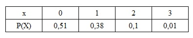
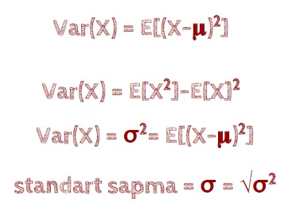
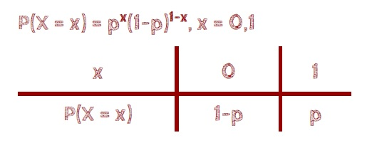
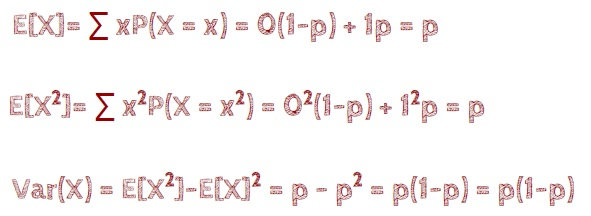
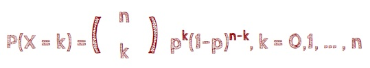

# Variance, Bernoulli and Binomial

* @file     : Variance_Bernoulli_and_Binomial.ipynb
* @author   : Sinan KAMILCELEBI
* @version  : V1.0.0
* @date     : 23-May-2019
* @brief    : The discrete uniform special probability distributions. Variance, Bernoulli and Binomial Example.

# I - Varyans 

## __Örnek Soru:__ 

X rassal değişkeni bir üretim sürecindeki kusurlu parça sayısını göstermektedir. Kusurlu sayıları ve bunların olasılıkları aşağıda verilmiştir.

__A)__ Ortalama kusurlu parça sayısını bulunuz?   

__B)__ Kusurlu sayısının varyansını bulunuz?

__C)__ Standart sapmayı bulunuz?

## __Açıklamalar:__

> Ortalaması 𝛍 olan rastgele X değişkeninin varyansı ve standart sapması (Varyansın pozitif karekökü):

# II - Bernoulli Olasılık Dağılımı

## __Örnek Soru:__

Bir öğrenci "Ayrık Sistemler için İleri Olasılık" dersinden geçme olasılığının 0.7 olduğuna inanmaktadır.  

__A)__ Olasılık dağılımının fonksiyonunu yazınız?

__B)__ Ortalamasını ve varyansını bulunuz?

## __Açıklamalar:__

> Bernoulli dağılımının olasılık fonksiyonu:

>> Olumlu/Başarılı/Hatasız: 1,   
>> Olumsuz/Başarısız/Hatalı: 0 olmak üzere,

>> p: Bir deneyin olma olasılığı iken;   
>> Başarı olasılığı: p, (0 < p < 1)   
>> Başarısızlık olasılığı: 1 - p   

> Bernoulli rassal değişkeninin ortalaması (μx = E(x)) ve varyansı Var(X):    

# III - Binom Dağılımı (Bernoulli Experiment)

## __Örnek Soru - I:__ 

Bir elektrik parçasının şok testine dayanma olasılığı 4/3'tür.   

__A)__ Denenen 4 parçadan 2 tanesinin bu teste dayanma olasılığını bulunuz? 

__B)__ Denenen 4 parçadan en az 2 tanesinin bu teste dayanma olasılığını bulunuz?  

__C)__ Denenen 4 parçadan teste dayananların ortalamasını ve varyansını bulunuz?

## __Açıklamalar:__

> X rastgele değişkeninin binomial dağılımı: X ~ Bin(n, p)

> Binom dağılımının olasılık fonksiyonu:

> Binom dağılımının ortalaması ve varyansı:

>> Ortalaması: μx = E[X] = n.p   
>> Varyansı: Var(X) = n.p.(1 - p)

## __Örnek Soru - II:__

Bir banka Master Card programı kapsamında müşterilerine kredi kartı verir. Geçmiş verilere dayanarak, banka tüm hesapların %60'ının faturayı takip eden zamanında ödeme yaptığını buldu. Geçerli veritabanından rastgele 7 hesap örneği seçilirse, zamanında ödeme yapan hesapların Binom Olasılık Dağılımını oluşturunuz.
